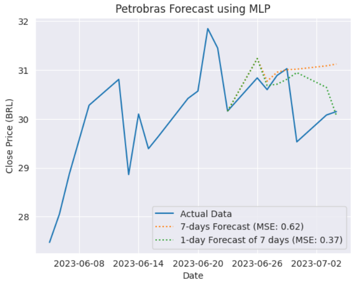

# Predicting Petrobras Stock Prices using 3 different models:

In this project, I analyzed the stock price of Petrobras from January 2000 to June 2023, and made predictions using three different models: a baseline model, an ARIMA model, and a multilayer perceptron (MLP) model. I began by conducting an exploratory data analysis (EDA) to gain insights into the data.

I then built a baseline model to predict the stock price by shifting the index by a specified number of periods, which was 1 in this case. The baseline model achieved a mean squared error (MSE) of 0.56 BRL for the entire dataset and 0.64 BRL for the 2023 dataset.

I then built an ARIMA model to predict the stock price. ARIMA models are a type of time series model that are specifically designed to handle data that exhibits trends and seasonality. The ARIMA model achieved a MSE of 6.63 BRL for the entire dataset and 2.72 BRL for the 2023 dataset. This model didn't perform well, so it can explored and understood further.

Finally, I built an MLP model to predict the stock price. MLP models are a type of neural network that can be used to learn complex relationships between the input and output variables. The MLP model achieved a MSE of 1.01 BRL for the 2023 dataset. For the 7-day forecast it achieved an MSE of 0.62 BRL, and the 1-day forecast of the next 7 days, it achieved an MSE of 0.37 BRL.

Overall, the MLP model performed the best in terms of MSE. However, it is important to note that the results of this study are only based on historical data and there is no guarantee that the models will perform well in the future.

### Models MSE:

- Baseline Model MSE (entire dataset):  0.56
- ARIMA Model MSE (entire dataset): 6.63
- Baseline Model MSE (2023): 0.64
- ARIMA Model MSE (2023): 2.72
- MLP Model MSE (2023): 0.89
- MLP Model MSE (7-day forecast): 0.62
- MLP Model MSE (1-day forecast): 0.37

Overall, the baseline model seems to do a better job of predicting when the entire dataset is considered. However, the MLP model did a good job; for the 7-day forecast it achieved an MSE of 0.62 BRL, and the 1-day forecast of the next 7 days, it achieved an MSE of 0.37 BRL.

Further improvements to this project could include selecting different ranges for the dataset, making monthly predictions based on moving averages, and implementing a production model to make real-time predictions.

